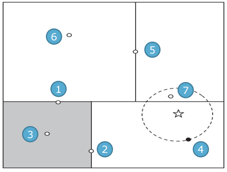

## Normalization
- numeric attributes
~~~
Ai = (vi - min vi) / (max vi - min vi)
~~~
- nominal attributes
- new instance
~~~
new instance의 attribute값과 다르면 0, 같으면 1 
~~~

> 모든 instance들과 new instance를 비교해서 값이 가장 작은 instance의 class 값으로 new instance의 class 값을 결정한다.
> 효율적인 알고리즘이 아니다.

## KD-tree
tree 형태로 O(logN) 시간에 class값을 찾을 수 있다.

> 하지만 위의 그림과 같이 더 가까운 것으로 분류 되지 않고 다른 instance값으로 분류가 되는 경우가 있다.

## Roll tree
그래서 각이 없는 구를 이용해 tree를 만들어 분류한다.
