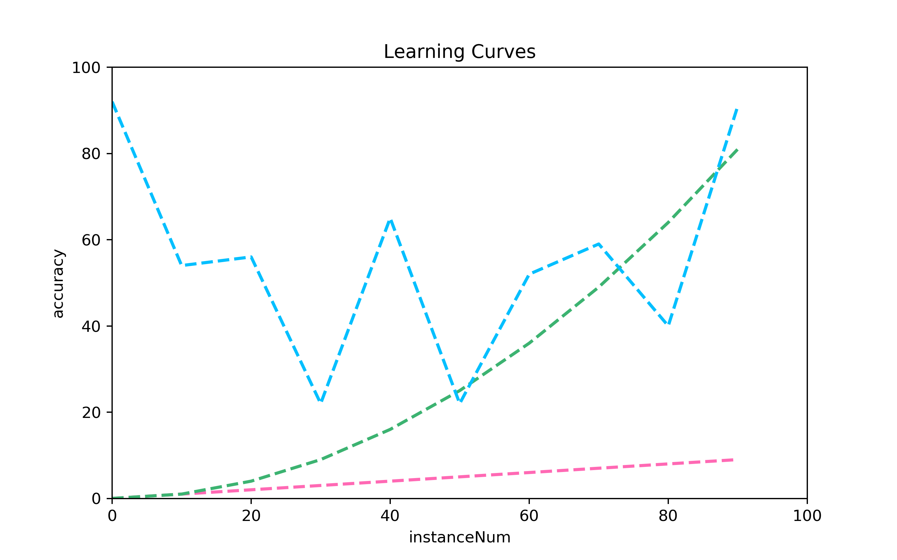

## Learning Curve 그리기

~~~
import matplotlib.pyplot as plt 
import numpy as np 
~~~
> matplotlib.pyplot : 그래프 그리기

> numpy : 다차원 배열과 행렬 연산에 필요한 다양한 함수를 제공, 메모리 버퍼에 배열 데이터를 저장 및 처리

~~~
np.random.seed(9)
xpoints = np.arange(0,100,10)
ypoints = [np.arange(10), np.arange(10)**2, np.random.choice(100, size = 10)]
~~~
> x 축, y축 data 값 지정

~~~
styles = ['dashed', 'dashed', 'dashed']
colors = ['hotpink', 'mediumseagreen', 'deepskyblue',]
widths = [2, 2, 2]
~~~
> 그래프의 선 style 과 color, width 를 지정

~~~
plt.figure(figsize=(8, 5))
for i in range(len(ypoints)):
    plt.plot(xpoints, ypoints[i], linestyle = styles[i], color = colors[i], linewidth = widths[i])
~~~
> 출력할 그래프 image 크기 지정, 함수그래프 그리는 for문

~~~
plt.title("Learning Curves")
plt.xlabel("instanceNum")
plt.ylabel("accuracy")
plt.xlim([0,100])
plt.ylim([0,100]) 
~~~
> 그래프 와 x축, y축 이름 지정

> x축, y축 최소, 최댓값 설정 ([0,100] = 0 <= a < 100)

~~~
plt.savefig("graphexamples.png", dpi=350)
plt.show()
~~~
> 출력하고 이미지파일 저장

